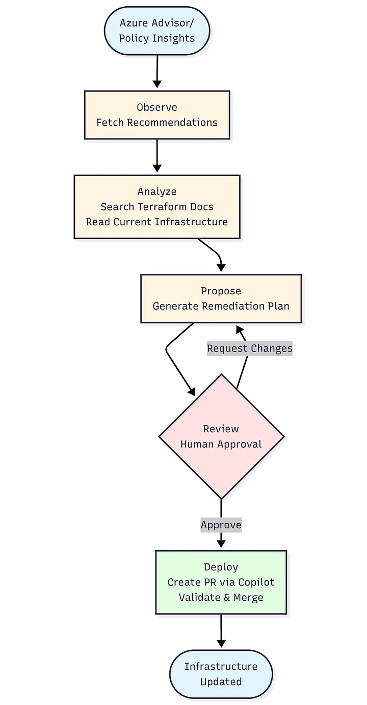
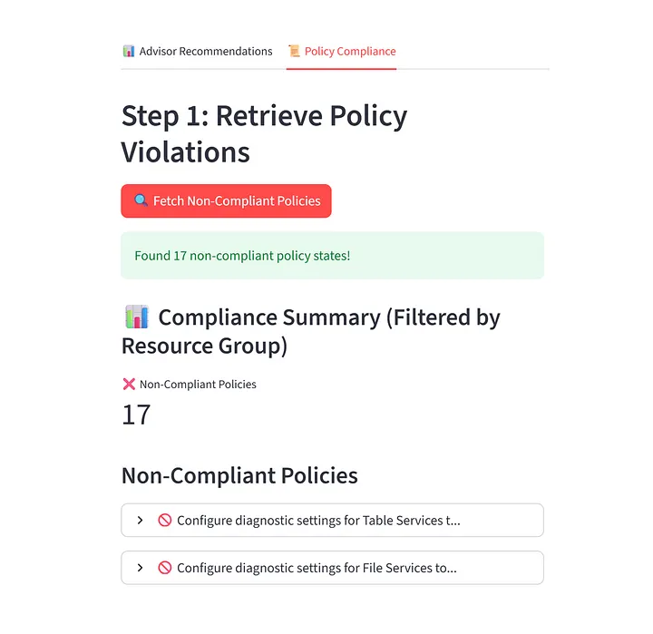
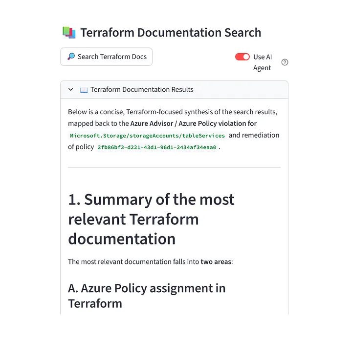
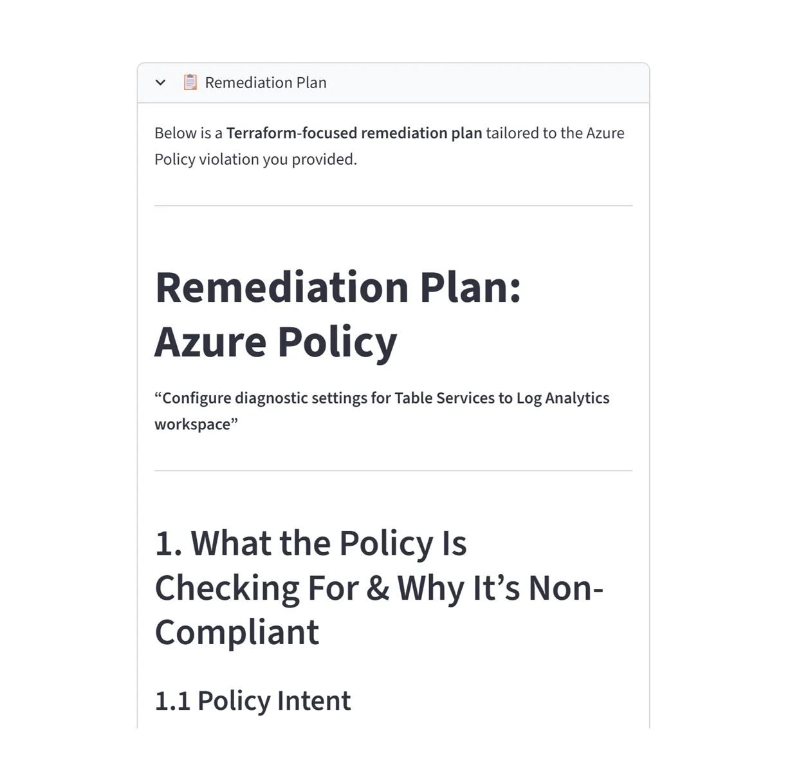
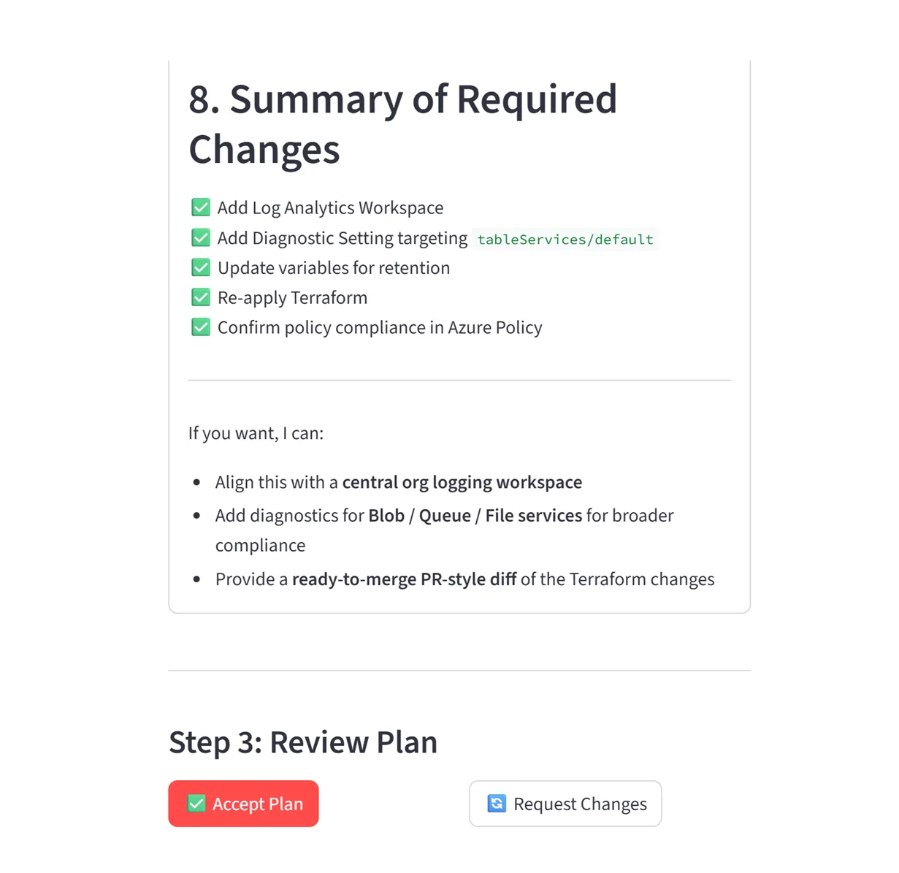
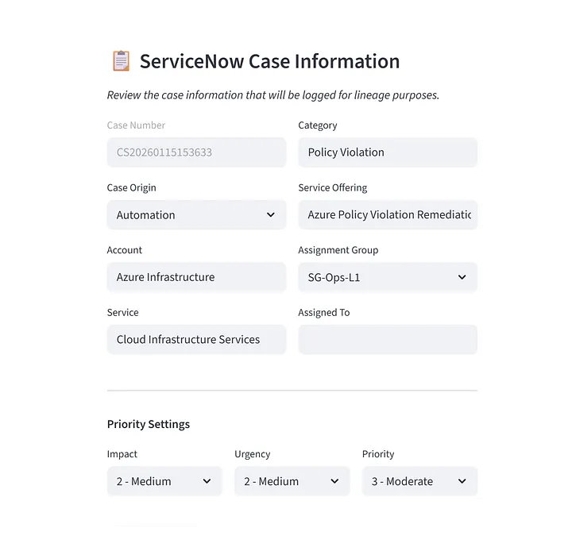
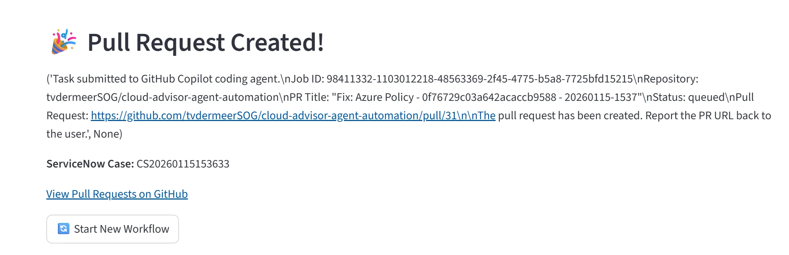
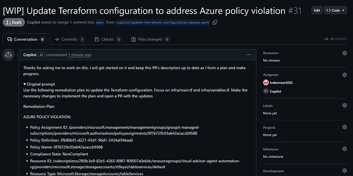

Closing the Loop: Automating Cloud Observability with AI Agents
Thomas van der Meer
Thomas van der Meer
8 min read
·
Jan 22, 2026

Modern cloud platforms can detect misconfigurations in minutes, yet many sit unresolved for months. Not because the fixes are difficult, but because manual remediation simply doesn’t scale across many resources and multiple subscriptions.

We’ve reached a paradox: observability has never been better, but addressing the surfaced issues is still painfully manual. Platforms surface security issues, cost inefficiencies, and compliance gaps instantly but solving is slow and a repetitive task.

In this post, I’ll show how I closed that gap by using AI agents to go beyond alerts. Automatically researching the fix, generating the IaC changes, and preparing a ready‑to‑review pull request.

The Observability Paradox
Modern cloud tooling is excellent at telling you what’s wrong: Azure Advisor highlights security recommendations, Policy Insights flags compliance failures, and monitoring surfaces performance issues. Awareness isn’t the problem. Execution is.

Each recommendation requires the same sequence of manual steps: research, validate the current state, write Terraform changes, test them, create a PR, wait for review, and deploy. Multiply this by dozens or hundreds of issues and you get a backlog that grows faster than your team can work through it. Meanwhile, high‑severity gaps, like unencrypted storage accounts or misconfigured Key Vaults, risk going unresolved for far too long.

We’ve optimized detection, but remediation hasn’t kept up.

What If Observability Could Act?
The classic workflow is slow: an alert becomes a ticket, a ticket becomes a task, and eventually someone writes a fix. One recommendation can take days.

With automation, that timeline collapses. Instead of just alerting, the system can analyze the recommendation, pull current documentation, inspect your infrastructure, generate a remediation plan, and create a ready‑to‑review PR. You’re still in control, but the repetitive work is handled automatically.

This is where AI agents excel. Not as autonomous actors, but as intelligent assistants that handle the heavy lifting. They gather context, propose changes, and produce consistent, review‑ready output. The bottleneck shifts from implementation to review, letting an engineer approve five recommendations in the time it used to take to fix one.

Architecture: Orchestrating Intelligence

The system uses a multi-agent architecture where each component has a specific responsibility. This separation makes the system easier to evaluate, debug, and improve over time.

Observation Layer: Azure Advisor and Policy Insights supply the set of high‑severity issues. This layer only collects signals so the system always starts from an accurate, up‑to‑date view of what needs attention.

Analysis Layer: Once you select an issue, one agent retrieves the latest Terraform documentation and another reads your existing Terraform files from GitHub. This combination gives the LLM both the correct syntax and the real state of your infrastructure, which prevents outdated or incorrect assumptions. This layer uses MCP servers. MCP creates a structured way for the agent to safely retrieve information from tools, like live documentation and repository files. This way the agent always works with the latest syntax and your real infrastructure state.

Planning Layer: Using the gathered context, the LLM creates a clear remediation plan. It explains what should change and why, identifies dependencies, and outlines the steps needed. No code is produced at this stage, which keeps reasoning separate from implementation and easier to review.

Review Layer: You review the proposed plan, request adjustments, or approve it. This human oversight ensures the solution aligns with architectural standards, organizational policies, and risk expectations before any code is written.

Execution Layer: After approval, the plan is sent to GitHub Copilot’s coding agent. The agent applies the necessary Terraform changes inside a sandboxed environment, runs formatting and validation checks, and opens a pull request. This approach avoids the common pitfalls of having an LLM modify code directly.

Validation Layer: GitHub Actions validates the pull request. When you merge it, your existing CI/CD pipeline performs the deployment. This keeps the workflow consistent with established governance and operational processes.

Why this multi-layer approach? Each layer has a different failure mode and different evaluation criteria. Documentation search can fail by finding outdated pages. Planning can fail by misunderstanding dependencies. Execution can fail with syntax errors. By separating these concerns, you can track and improve each independently. When something goes wrong, the traces show you exactly which layer failed and why.

Walkthrough: From Recommendation to Merged PR
This walkthrough demonstrates how the system resolves a real Azure Policy violation, from detection to a ready‑to‑merge pull request, with minimal manual effort. In this example, Table Services are missing diagnostic settings that should forward logs to a Log Analytics workspace.

Step 1: Fetch and Select

The Streamlit interface retrieves all non‑compliant resources from Azure Policy Insights, including the policy, resource type, and reason for failure. You pick the violation to address, and the system captures the required details as input for the repair process.

Step 2: Gather Context

Write on Medium
The system retrieves two context sources: the latest Terraform documentation for the affected resource and your existing Terraform configuration from GitHub. Using MCP servers, it always works with current docs and live infrastructure state.

Step 3: Create the Plan

With the context collected, the model generates a remediation plan describing the required Terraform changes, dependencies, and resource relationships. It focuses on reasoning rather than code, explaining how the fix, such as adding diagnostic settings for Table Services, should be structured.

Step 4: Review and Refine

You review the plan and adjust it as needed. Any feedback you give in natural language is incorporated into an updated version until you approve the approach. This keeps you in control while the system adapts to your requirements.

Step 5: Change Tracking

The system generates a prefilled ServiceNow case linking the policy violation to the proposed fix. This ensures traceability and supports organizations with formal change‑management obligations.

Step 6: Execution

With the plan approved and change case created, you click to generate the pull request. Behind the scenes, the system calls GitHub Copilot’s PR creation API, passing it the remediation plan. The Copilot coding agent spins up a sandbox environment, checks out your repository, reads the Terraform files, makes the necessary edits based on the plan, runs terraform validate, and creates a pull request.

Step 7: Validation and Merge

The pull request shows the exact Terraform changes that will resolve the violation. GitHub Actions runs validation checks, and once everything looks correct, you merge the pull request. Your existing pipeline deploys the changes to Azure, and the policy violation clears from the compliance dashboard.

The entire process takes about ten minutes. A manual version of the same workflow would typically require thirty to forty-five minutes of research, editing, testing, and PR creation. Automating the flow reduces the work to reviewing and approving changes while leaving the mechanical steps to the system.

What I Learned Building This
Building an infrastructure automation system powered by a multi-agent workflow taught me some valuable lessons.

Context Is Everything

Early versions looked convincing but were wrong because they used outdated attributes, missed dependencies, or produced generic fixes that did not match our environment. These issues disappeared once the system combined two sources of truth: current documentation and our actual Terraform state.

Coding tasks need a harness

Allowing an LLM to edit Terraform directly turned out to be unreliable. The solution was a “plan first, code second” workflow. The LLM focuses on explaining the required changes, and Copilot’s coding agent applies those changes safely in a sandbox with full linting and validation. The plan/build approach is also an emergent best practice seen in users interacting with coding agents such as Claude Code, Codex and Opencode.

The PR Is the Product

In regulated environments, infrastructure changes cannot be deployed automatically. The pull request is not a point of friction but the essential deliverable. It provides a clear record for review, an auditable trail for compliance teams, a safe rollback point if needed, and a shared space for engineers to collaborate.

I initially assumed this step would slow everything down. It turned out to be the opposite. The pull request is where trust is created. Security teams can see exactly what is being modified. Platform engineers can spot edge cases before they reach production. Compliance teams get the documentation they need without additional overhead. Instead of acting as a black box, the system becomes a transparent and collaborative workflow.

Closing the Loop

Observability without action is just expensive logging. The real value comes from closing the loop, using insights to drive continuous and automated improvements. Although our tools detect issues faster than ever, addressing the issues still largely relies on slow, manual effort. That is the gap AI agents are designed to address.

The system I’ve built isn’t perfect, and it’s not trying to be. It’s not replacing platform engineers. It’s giving them a force multiplier. Instead of spending hours on each recommendation, they spend minutes reviewing plans and approving changes. Automation handles the repetitive work, and engineers retain ownership of the decisions that require judgment. This balance creates both speed and trust.

For anyone building similar capabilities, start small. Choose a high‑severity but low‑complexity recommendation type. Invest in evaluation and observability for your own system from the beginning. Involve security and compliance teams early. Treat the pull request as the core deliverable. And keep planning and execution separate so each part can improve independently.

Observability tells you what matters. Automation makes it possible to act on it. Start small, build trust, evaluate continuously, and close that loop.

The code for this system is open source. If you’re working on similar challenges in regulated environments, I’d love to hear about your approach.