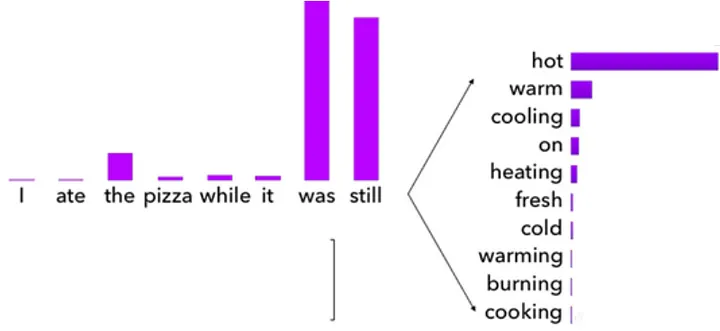
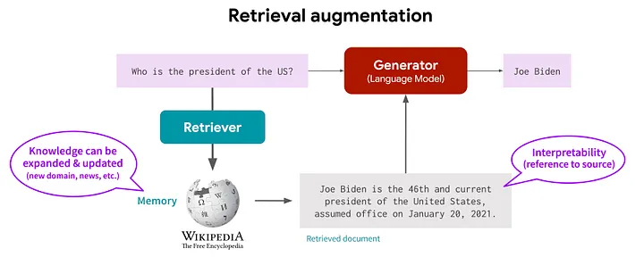

NLP and knowledge: an unrequited love
Thomas van der Meer
Thomas van der Meer
6 min read
·
Jun 28, 2023

“I apologize, but as of my knowledge cutoff in September 2021, I do not have information on the current subject.”

If you have ever used ChatGPT, this response is a familiar thing. The question about a fact you want to know is answered with this standard sentence. Or even worse, the Large Language Model (LLM) powering your chat conversation produces a factually incorrect answer. “Hallucinating”, defined as “generated content that is nonsensical or unfaithful to the provided source content”, is emergent behaviour of LLM’s that is caused by the objectives and available information during training.

Having factual information or ‘knowledge’ in your LLM is ideal to assist you in your endeavors. Especially when it is contextual knowledge based on your own situation. This blog will introduce how knowledge is acquired in the LLM’s, the history of “gaining” knowledge in language modeling and the state of the art in how LLM’s are modeled to use mechanisms to gain knowledge most effectively.

Knowledge in training
In the last decade, language modeling has evolved through training deep neural networks on enormous amounts of text. The training objective for these neural networks is to predict the highest probability of the next word based on earlier input. This is also called pre-training. In figure 1, based on the words “I ate the pizza while it was still”, the next word of the distribution of words that is likely to follow is “hot, warm, cooling, …” with descending probability.

Figure 1 The probability distribution of the next word in the sentence (source)
While training on this objective, the model gains a certain notion of what the next word in the sentence should be, but this does not show that a model has “knowledge’, especially on domain specific texts. This domain specific text has another vocabulary, and the distribution is probably different. Transfer learning is the method to adapt a language model to a domain through training the model on texts from domain specific documents (ULMFiT). This method trains the language model to adapt to the new distribution, but it has a downside. Catastrophic forgetting is an unwanted behavior whereby trying to adapt to the new distribution, important general knowledge in the fundamental layers of the language model is lost.

Fine-tuning
In the 2010’s, the pre-training of language models was followed by fine-tuning on downstream tasks. Most famously, the BERT model was first pre-trained on masked language modeling (a special kind of next word prediction), whereafter a downstream task-specific “head” was trained in a supervised manner to do classification, question answering and other tasks. Based on the underlying neural network that learned the representations of words and to a certain extent the semantic patterns of these words, the head can ‘understand’ the intent of the input and generate a classification or textual output accordingly (BERT). While this worked well for these downstream tasks, fine-tuning requires a sizeable, labeled dataset to perform. When there is a mismatch between your objective and the dataset to train on, or you do not have the resources to create a labeled dataset, you are out of luck.

Knowledge injection
To further enhance the knowledge of models without transfer learning or fine-tuning, several architectures were proposed to add or inject knowledge in language models. One example is ERNIE, an architecture that leveraged knowledge graphs to inject extra information about entities in texts while pre-training. Another architecture that was proposed is K-adapter, an architecture where smaller neural networks (adapters) are trained on, for example, knowledge graphs and infuses the main language model with the outputs of these adapters. Where both these architectures improved on some (mostly knowledge intensive) tasks, it never got real traction, probably due to the limited improvements.

Prompting
In 2018, Open-AI introduced models that were trained to perform on the same downstream tasks without fine-tuning (GPT-2), called a zero-shot setting. The most substantial gains were made by using a bigger and more diverse training dataset, consisting of humanly curated texts from websites, more parameters and longer training. The resulting model introduces the era of LLM’s, where models with billons of parameters are trained on trillions of tokens. These models can generate texts well but still need guidance to ensure the model gives an appropriate answer aligned with your intention. Where that has been done in the past in multiple fashions by transfer learning and downstream-tasks fine-tuning, now this is enabled through prompting.

Download the Medium App
Prompting is defined as “a user-provided input to which the model is meant to respond. Prompts can include instructions, questions, or any other type of input, depending on the intended use of the model” (Nvidia). A prompt can be a question, where the LLM answers that with the answer. More sophisticated ways of prompting are few-shot prompting, where you give one or multiple examples of what you would like the LLM to generate, or chain-of-thought (CoT) prompting, where you ask a question followed by a text like “Let’s think about this logically”, to steer the model towards generating a text that answers your question step by step.

While good prompt engineering reduces faulty generation or hallucination, prompting is not a silver bullet solution. Also, a model is trained on a dataset that has a certain cutoff date. Text that is produced later than the cutoff date cannot be trained on and therefore cannot be learned by the LLM. Also, information that is not publicly available is not expected to be returned from the LLM. If there was a way to make the LLM learn about this new text and reason over this….

Figure 2 An example of RAG (source)
Retrieval Augmented Generation (RAG)
This is where retrieval augmented generation comes in. This method is best explained in a figure since it consists of multiple steps (figure 2). The first step is to define a question you would like to be answered, defined as a query (‘Who is the president of the US?’). Instead of directly sending it to the LLM to get an answer, the query is used to search through a knowledge source (Wikipedia here) to find text that is similar to your query. The found relevant information is extracted from the knowledge source and is sent with the question to the LLM. The LLM can now use the relevant information from the knowledge source to reason over and give an answer that is grounded in this information. And in the end, the result is a response that is most likely factually correct as long as the relevant information in the knowledge source is true. However, the drawbacks here are that this method requires the setup of knowledge sources to query and more tokens to be sent to LLM’s, which comes with a cost factor.

To conclude, knowledge in NLP has come a long way. Where it started in the 2010’s with learning semantical representation of words, nowadays full knowledge retrieval systems are built to feed LLM’s contextual information. And this is not where it ends. Firstly, OpenAI is to make (third-party) plugins available to interact with ChatGPT where new applications for LLM’s can be developed(OpenAI’s blogpost). Secondly, the open-source community delivers fresh tools that we can use to create useful and interesting interactions with LLM’s. To give you an idea of some tools that are up and coming now, please look at LangChain, babyAGI, and Transformers Agent. Hopefully, the coming years bring more breakthroughs in the form of smaller, better performant multimodal models that can be used on personal hardware, with new integrations with the likes of search-engines and other knowledge sources so that we can truly leverage the power of LLMs/AI.