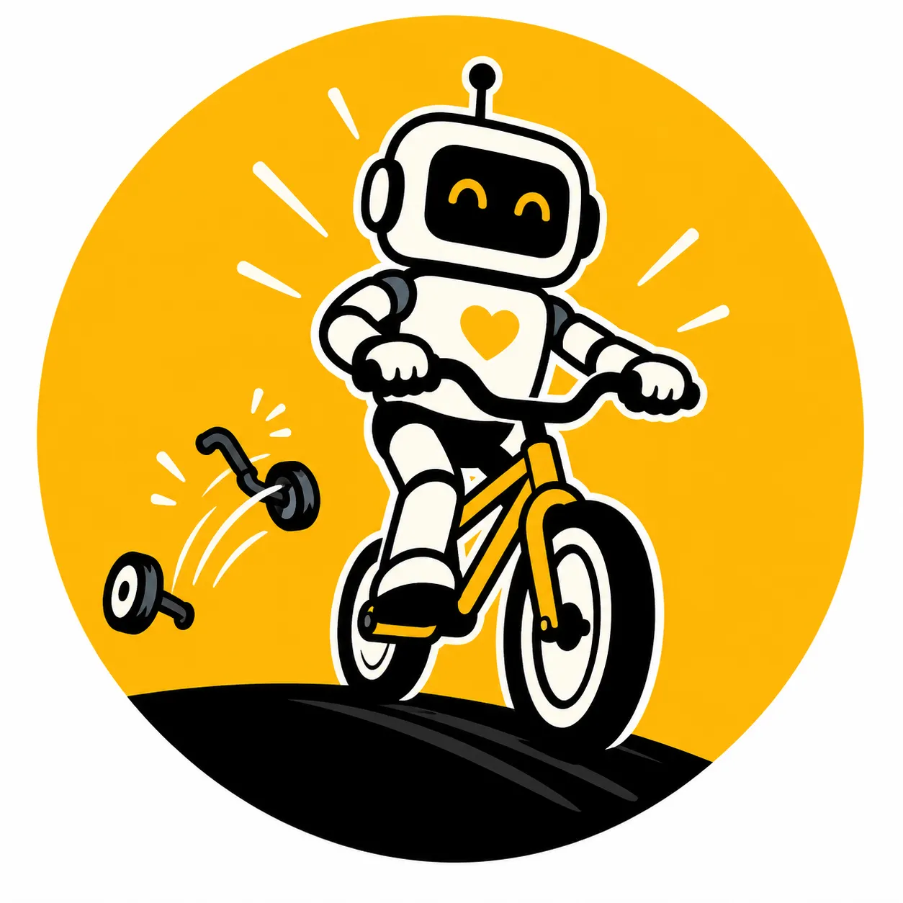
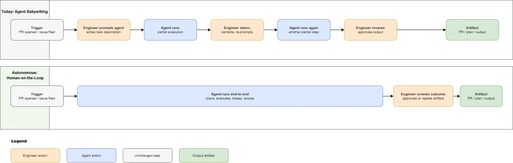
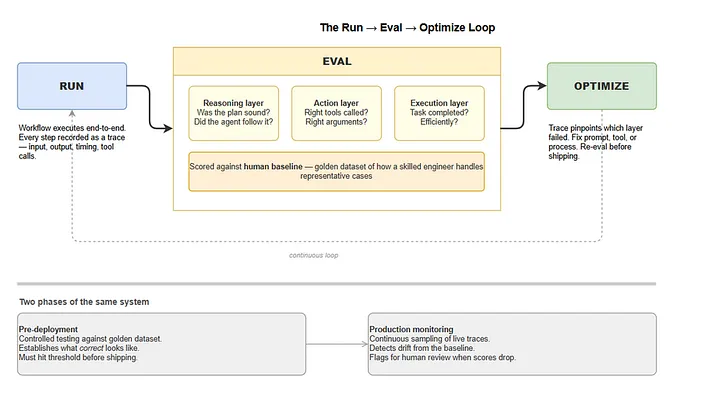

From Copilot to Autonomous: Stop Babysitting Your Agents
Thomas van der Meer
Thomas van der Meer
8 min read

Your engineers have GitHub Copilot. Maybe they’ve moved on to Claude Code or Cursor agents. Productivity is up. Demos look impressive. But the backlog has not shrunk. The repetitive work is still there. A developer is still supervising the work step by step instead of letting a defined process carry it. The interface changed. The bottleneck did not. I call this agent babysitting. It is not a failure of the technology. It is a failure to redesign the workflow around it.

## The Agent-Babysitting Trap
Coding agents are a genuine step beyond autocomplete. They can read your codebase, plan a multi-step task, make changes across files, run tests, and open a pull request. But in most teams, that capability is still wrapped in the same operating model: a developer supervises the work step by step. That is the agent-babysitting trap. Teams stay there for understandable reasons.

Trust. If you do not know what an agent will do next, you cannot let it run unsupervised.

Governance. If no one can explain what the agent did, who approved it, or how quality is monitored, the default is to keep a human in every loop.

Engineer adoption. People who know the system best are often the least willing to hand part of it to a workflow they do not yet trust.

None of these blockers are technical problems. The models are capable enough for well-scoped, repetitive work, even with real constraints like context limits and reasoning consistency on long tasks. The tools exist. What’s missing is the organisational structure that makes autonomous workflows trustworthy. That’s a decision-maker’s problem, not an engineer’s.

### What “Autonomous” Actually Means
When most people hear “autonomous agent,” they picture something unsupervised and unaccountable. That is not what I mean.

Autonomous, in this context, means event-driven and process-complete. A trigger fires, the workflow runs end-to-end, and it produces a reviewable artifact. The human role changes. Instead of sitting inside the workflow, they define the process and success criteria at the start, then review the output and make the final call at the end.

Human-in-the-loop becomes human-on-the-loop. In practice, that is the difference between one engineer supervising one agent and one engineer reviewing the output of ten.

If the agent consistently needs clarification halfway through, the workflow is not well-defined enough yet. That is a process design problem, not a technology problem. Mature engineering processes already work this way. Autonomous workflows apply the same model to repetitive work that still lacks a structured process.

## The Concrete First Step: Build One Workflow
The teams that make this transition successfully do not start by automating everything. They build one workflow properly.

A good first candidate is automated PR review. The workflow is already familiar, the inputs are structured, and the output is easy to inspect. It also addresses all three blockers from section one at once: trust is low-stakes, governance is built into the review artifact, and engineer adoption is easier because the reviewer still makes the final call.

On a well-scoped workflow like PR review, the difference is not magic. It is consistency. Every pull request gets the same first-pass scrutiny: changed files inspected, likely regressions called out, missing tests noted, and obvious policy violations surfaced. A human reviewer may still disagree with individual findings, but they are reacting to an artifact, not starting from a blank page.

Other good first candidates follow the same pattern:

Automated release notes generation: triggered on a merge to main, reads the diff and linked tickets, produces a structured summary for the changelog.
Dependency update triage: triggered by a Dependabot PR, checks for breaking changes, runs existing tests, labels the PR as safe-to-merge or flags it for human review.
Incident post-mortem drafting: triggered on incident close, pulls the timeline from logs, drafts a structured document for the engineer to edit and approve.
Each of these has a clear trigger, structured input, and a reviewable output.
That is what turns a chat interaction into a workflow: the harness around it. A trigger, structured input, observable execution, and a scored output.

Autonomous workflows belong on work that is repetitive, precise, and standardised. Work that depends on creativity, judgment, or interpersonal context should stay human. A useful test is simple: can you define what a good output looks like before the agent runs? If yes, it is a candidate for automation.

Building that harness from scratch takes time because the same scaffolding appears in every workflow: triggers, tracing, and evaluation against a golden dataset. I have been working on a solution to skip that boilerplate. Once one workflow is running well in production, the next one takes a fraction of the time.

### The Part Everyone Underestimates: Run → Eval → Optimize
The part most teams underestimate is evaluation. A workflow can look good in a handful of runs and still drift quietly in production if nobody is measuring it.

The **run → eval → optimize** loop is what makes autonomous workflows governable.

Run. Record the full trace so the workflow is debuggable and auditable.

Eval. Score reasoning, action, and execution against a human baseline across a golden dataset of representative inputs with known-good outputs. Agent workflows fail in distinct ways at distinct layers, so evaluation needs to cover all three.

Reasoning layer: did the agent form a sound plan? Plan Quality measures whether the plan is logical and complete for the task. Plan Adherence checks whether the agent actually followed it.
Action layer: did the agent use the right tools, with the right arguments? Tool Correctness and Argument Correctness catch the common failure where the right tool is selected but called with wrong parameters.
Execution layer: did the agent complete the task, and did it do so efficiently? Task Completion is your primary pass/fail signal. Step Efficiency flags agents that succeed but burn redundant steps — relevant once you are paying for tokens and latency at scale.
A high Task Completion score with a low Step Efficiency score is a useful early signal: the workflow works, but it is not ready for production volume. Production-ready does not mean “it looked good a few times.” It means the workflow clears the bar across all three layers consistently.

Optimize. As models, prompts, and inputs evolve over time, optimization relies on continuous scoring and tracing to detect when performance drops; the trace pinpoints exactly where the workflow weakened, allowing teams to fix the issue and verify that scores recover before changes reach production. While the exact score thresholds vary by workflow, the evaluation dimensions remain consistent and reusable, focusing on plan soundness, tool correctness, task completion, and overall efficiency.

This is what turns governance from a blocker into evidence. Instead of asking people to trust the workflow, you show them the baseline, the output, and the measured gap between them. That evidence is also what leadership needs to make the conditions for autonomous workflows possible.

What Leadership Needs To Do
The technical solution exists. If your organisation is not running autonomous workflows in production, the bottleneck is usually not the technology. It is the conditions around it. Leadership does not need to understand how the models work. It needs to create three conditions that let engineers build workflows properly.

1. Protect the time to build the first workflow well.
The first workflow usually takes longer than expected because the team is not just automating a task. They are building the harness, capturing a human baseline, and defining what “good” looks like. That foundational work is easy to underestimate and easy to lose if it is treated like a normal backlog item competing with delivery pressure. Instead of treating it as open‑ended investment, the goal should be disciplined scoping: make the first workflow small enough to finish, but large enough to justify the harness. Reserve a comfortable margin for tracing, evaluations, and iteration so this work does not get squeezed out, ensuring the workflow ships with the evaluation layer that makes it trustworthy.

2. Define what production-ready means before anything ships.
Most organisations already know what production-ready means for a feature. For agent workflows, that definition is usually missing. Define it in advance: what threshold must the workflow hit, what gets traced, what gets scored, who reviews the results, and who can pause the workflow if quality drops. The framework does not need to be heavy. It just needs to exist before the workflow reaches production.

A useful starting point for thresholds: a PR review workflow that agrees with human reviewers on flagged issues more than 80% of the time and produces zero critical false negatives (missed security issues, missed breaking changes) over a two-week trial is a reasonable bar before full rollout. For throughput, a workflow processing 50 PRs per week that saves each reviewer 15 minutes of first-pass work represents roughly 12 hours of recovered engineering time per week, a number leadership can weigh against the build cost. These specific numbers will vary, but naming the threshold before shipping is what makes the governance framework real rather than aspirational.

3. Give engineers real ownership of the result.
Engineers need more than implementation responsibility. They need the authority to monitor quality, respond to drift, and pause a workflow when the signals say it is no longer meeting the bar. When eval scores are visible and treated as operational signals, teams build differently. They stop thinking of the workflow as a one-off feature and start treating it like a system they are accountable for.

The teams getting this right are not moving faster than everyone else. They are moving more deliberately, with protected time, explicit quality criteria, and engineers who have the authority to build workflows worth trusting.

Closing
This is achievable now. Pick one repetitive, well-scoped workflow. Define what good looks like before the agent runs. Capture the human baseline, build the harness, and do not ship until the workflow clears the bar.

That is how you get past the blockers that keep teams stuck. Trust comes from evidence. Governance comes from a framework. Adoption comes from ownership.

Stop babysitting the agents. Give them a process worth running. If you are working through this transition, I would be glad to hear how it is going or where it is getting stuck.
